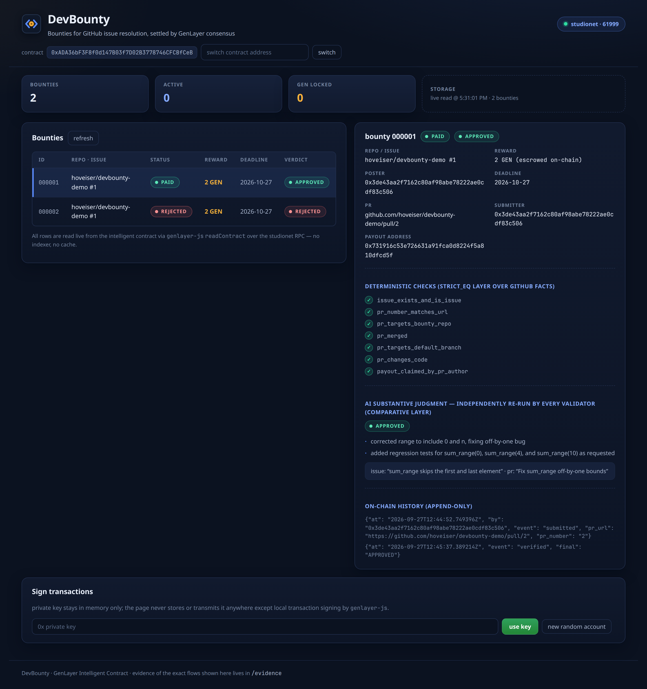
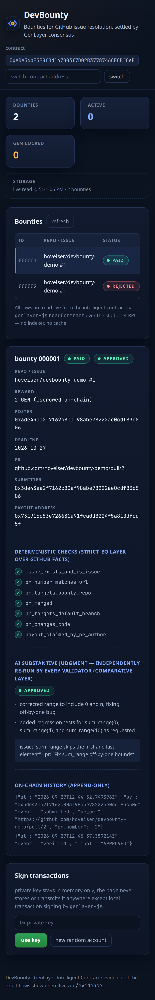

# DevBounty

**Bounties for GitHub issue resolution, settled by GenLayer consensus.**

Anyone posts a bounty against a *real, public GitHub issue* and locks GEN reward
inside an intelligent contract. A contributor submits a PR URL. The contract then
verifies — **independently, on leader *and* validator nodes** — that the PR (a)
targets the right repository, (b) is merged into the default branch, and (c)
*substantively addresses* what the issue describes. Only a consensus verdict can
move money: APPROVED pays the contributor's registered address from escrow;
otherwise the poster reclaims after a timeout. One appeal re-runs the whole
verification with a fresh validator set.

Live dapp frontend: **[https://hoveiser.github.io/devbounty-genlayer/](https://hoveiser.github.io/devbounty-genlayer/)**
— deployed via GitHub Pages, reading on-chain state directly from the public
studionet RPC in the browser (no backend, no indexer). Source:
[`frontend/`](frontend/) (plain HTML/JS + the official `genlayer-js` SDK).

**▶ 70-second demo** (burned-in captions; live dapp + repo; no audio track —
offline TTS was unavailable in the build environment):
[watch on the release](https://github.com/hoveiser/devbounty-genlayer/releases/tag/demo-video)
· file [`evidence/demo.mp4`](evidence/demo.mp4).

> The deployed bundle has the live contract address baked in **at build time**
> (`CONTRACT_ADDRESS` env → esbuild `--define`, see
> [`frontend/build.mjs`](frontend/build.mjs)); CI asserts it and rejects
> placeholder builds. Auto-deployed on every push to `main` by
> [`.github/workflows/deploy-pages.yml`](.github/workflows/deploy-pages.yml).

A dark “deep-slate” UI — system sans typography with a clear hierarchy, stat
cards, a styled table, and **colour-coded status/verdict pills** (blue OPEN, amber
SUBMITTED, green PAID/APPROVED, rose REJECTED), shimmer skeletons while the live
reads resolve, and a responsive single-column layout on mobile. Original
`<>`-coin mark as favicon (`frontend/assets/`) and 512px logo (`assets/logo.png`).
All plain CSS / vanilla DOM on the existing esbuild bundle — no framework, no
webfonts, no external CSS.



| Mobile (390px) — same live data, fluid layout | |
|---|---|
|  | |

---

## Why this *needs* GenLayer (and what a single LLM would cost)

The payout decision combines an **external fact check** (GitHub API) with an
**AI-mediated judgment** ("does this diff actually fix what the issue asks?").
That is exactly the setting where a single off-chain oracle is exploitable:

* **Leader-only exploit:** if one node fetches GitHub and prompts one LLM, the
  attacker bribes/fools that one path. A manipulated `merged: true`, a cached
  stale response, or a prompt-injected issue body directly moves escrowed GEN.
* **Prompt injection:** issue/PR bodies are attacker-controlled text embedded in
  the judgment prompt. Here, untrusted content is sanitized (tag-escape, control
  chars, override-phrase redaction, hard truncation) and wrapped in
  `<untrusted_*>` markers; the Direct-Mode suite contains an
  [injection test](tests/direct/test_devbounty.py) with a *trap mock* that only
  fires if raw breakout markup leaked into the prompt — it must (and does) fail
  closed to `REJECTED`.
* **GenLayer's fix:** every validator re-fetches the GitHub data and
  **re-runs the LLM judgment itself**; a verdict only commits when independent
  executions agree. Disagreement rotates the leader. This is not decoration —
  the rejection demo below shows money moving *only* because the consensus AI
  layer said so after every deterministic check passed.

## Equivalence split (two layers, deliberately separated)

| Layer | What it decides | Equivalence principle |
|---|---|---|
| **Facts** | issue exists & is an issue · PR number matches URL · PR targets bounty repo · PR merged · targets default branch · contains real changes · **payout address claimed by the PR author for this bounty** | `gl.eq_principle.strict_eq` over a JSON summary of **only stable GitHub fields** (`number`, `merged`, `base.repo.full_name`, `base.ref`, `additions`, file list, PR author login + the author's own claim comments). Volatile fields (`updated_at`, reaction/comment counts) are never extracted, so edits can't break equivalence; a mid-verification edit just causes disagreement → rotation, never a wrong verdict. |
| **Judgment** | "does the diff substantively resolve the issue?" — inherently subjective | genuine **comparative validator** via `gl.vm.run_nondet_unsafe`: the validator **independently repeats the whole fetch + `exec_prompt`** and compares the stable `decision` field plus token-overlap on `reasons`. LLM misbehavior is classified `[LLM]` and **always disagrees** (forces rotation). Error taxonomy: `[EXPECTED]`/`[EXTERNAL]` match exactly, `[TRANSIENT]` agrees-if-both. |

Merged-PR rule (documented choice): the PR is considered **merged** iff the
GitHub API reports `merged: true` **and** its base branch equals the repo's
`default_branch` at verification time.

## Architecture

```
 poster                     contributor                  GenLayer studionet
┌──────────┐  GEN (native)  ┌──────────┐   GitHub API   ┌─────────────────────────────┐
│ create & │───────────────>│ post PR- │<──────────────>│ DevBounty intelligent       │
│ fund     │  create_bounty │ author   │  fetched by    │ contract                    │
│ bounty   │  @payable      │ claim +  │  leader AND    │  TreeMap<id, Bounty>        │
└──────────┘                │ submit   │  every         │  append-only history        │
     │  reclaim_after_      │  merged  │  validator     └──────────────┬──────────────┘
     │  timeout (open/      │  PR +    │                   verify_resolution:
     │  rejected only,      │  payout  │                   strict_eq facts + claim ─┤
     │  never under a live  │  address │                   comparative LLM ─────────┘
     │  submission)         └────┬─────┘                                │
     ▼                           ▼                                       │
 poster ◄── EthSend ── escrow   payout EOA ◄── EthSend ── on APPROVED ───┘
 reclaims                       (never on REJECTED)
 frontend (genlayer-js) ── reads get_bounty / get_evidence / list_bounties / stats
                       ── live tx lifecycle: SUBMITTED→PENDING→ACCEPTED→FINALIZED
```

* **Frontend owns nothing authoritative.** It only renders on-chain reads
  (`readContract` over the studionet RPC) and signs writes. There is no indexer.
* **The contract owns** escrow, verdicts, payouts (`@gl.evm.contract_interface`
  → `EthSend`), reclaim, and the one-shot appeal.
* Money is `u256` atto GEN end-to-end — no floats. Storage uses `TreeMap` /
  `DynArray` / `str` status only (no Enum in storage). Failures raise
  `gl.vm.UserError`.

## Live on studionet — every tx independently verified

Chain: **studionet** (`https://studio.genlayer.com/api`, chain id 61999).
Verification of *every* hash below was done against the explorer's **JSON API**
(not the HTML shell) and is recorded in [`evidence/live_flow.json`](evidence/live_flow.json):

```bash
curl -sS -H 'User-Agent: devbounty/1.0' \
  https://studio.genlayer.com/api/explorer/transactions/<hash> \
  | jq '.transaction.status, .transaction.consensus_data.votes'
```

The real-world fixture is [github.com/hoveiser/devbounty-demo](https://github.com/hoveiser/devbounty-demo):
issue **#1** documents an off-by-one in `sum_range`; **PR #2** (merged, squash)
fixes it and adds regression tests; **PR #3** (merged) is a decorative README
ASCII banner *deliberately unrelated* to the issue.

Both scenarios below run against the **security-audited** deployment
(`0xADA3…fCeB`) and include the PR-author claim comment step of the
authorship mitigation.

### Scenario A — genuine fix pays out (audited contract `0xADA3…fCeB`)

| step | tx | explorer verdict |
|---|---|---|
| deploy | `0x3e83c129…f5dd` | FINALIZED · 5 validator votes |
| `create_bounty` **with 2 GEN native value** | `0x057dc2c3…4b2e` | FINALIZED · votes all `agree` |
| PR-author claim comment on PR #2 (GitHub side, `bounty 000001 payout 0x7319…Cd5f`) | — | visible on the public PR |
| `submit_pr` (PR #2) | `0x2a611fca…8015` | FINALIZED |
| `verify_resolution` | `0xc5a8a682…e51f` | FINALIZED |

**Settlement proven against the recipient's balance, not a status field:**
payout EOA `0x7319…Cd5f` went `0 → 2000000000000000000` atto (delta exactly
the escrowed 2 GEN). On-chain evidence stores the **seven** deterministic
checks (six GitHub facts + `payout_claimed_by_pr_author`), the LLM
`decision: APPROVED` and its **reason list** — visible in the live frontend.

### Scenario B — merged-but-unsubstantive PR is rejected by the AI layer (same audited contract, bounty `000002`)

Fresh 2 GEN bounty; contributor claims + submits **PR #3** (README banner).

| step | tx | result |
|---|---|---|
| `create_bounty` (2 GEN) | `0x1e0e2ed8…f756` | FINALIZED |
| claim comment + `submit_pr` | `0xd8bdad10…7096` | FINALIZED |
| `verify_resolution` | `0x2cfdf1ba…848b` | FINALIZED |

On-chain evidence: **all seven deterministic checks ✓** (right repo ✓, merged
✓, default branch ✓, real diff ✓, **author-claimed payout ✓**) — and the
consensus LLM still returned `REJECTED`: *“the pull request does not address
the issue described … the pr only adds an ascii banner; no changes were made
to math_utils.py or any test files as requested by the issue.”* Recipient
balance delta: **0**. **This is the proof that the AI judgment layer — not a
checkbox — is doing the settlement work every validator independently agreed
on**, and that passing the claim check does not buy an approval.

### Scenario C — the same story through the official gltest harness

`tests/integration/test_studionet_flow.py` passed against real consensus
(audited contract `0x96f2…b571`, deploy tx `0x6662dcdc…1c48`, recorded in
[`evidence/integration_studionet.json`](evidence/integration_studionet.json)):
create `0x1b20fc5a…0616` · claim comment + submit `0x9012a6ea…257b` · verify
`0x1a85ecee…ca50`, all FINALIZED, verdict APPROVED, the exact seven-check
set asserted by name, payout EOA balance `0 → 1000000000000000000` atto.

## Security audit — gaps, fixes, proof

Every item below was resolved with a **test that fails on the vulnerable
behavior and passes on the fixed one** (run against the pre-fix contract to
confirm the failure first, where applicable). Proof tests live in
[`tests/direct/test_security_audit.py`](tests/direct/test_security_audit.py).

| # | Question | Verdict before | What was done | Proof |
|---|---|---|---|---|
| 1 | Does `create_bounty` enforce value == reward? | **Not a gap — impossible by construction.** There is no declared-reward parameter: `reward := gl.message.value`. "Promise 2 GEN, send 1 GEN" cannot be expressed; value can only *be* the promise. `value > 0` is enforced. | Documented; exact odd-value round-trips and the "submit_pr cannot touch reward" invariant pinned by tests. | `test_reward_is_exactly_the_sent_value`, `test_create_requires_value` |
| 2 | PR-authorship race — can an opportunist front-run `submit_pr` and steer the reward to their own wallet? | **REAL GAP (as originally designed).** `submit_pr` accepted any caller + any payout address. | **Implemented mitigation (option b — author-side claim):** the PR author posts `devbounty-claim: bounty <id> payout <addr>` on the PR from their own GitHub account; the deterministic layer fetches the PR's author login and the PR's comments (both under `strict_eq`) and requires a comment **authored by the PR author**, naming **this bounty id** (digit-boundary checked) and **the registered payout address** (bounded 40-hex token match). Any wallet may still *call* `submit_pr` — it can only ever register an address the author already claimed, so front-running moves nothing. Residual risk, stated honestly: the mitigation anchors wallet↔author binding to GitHub account integrity (a compromised author account, or an author who claims to a stolen-for address, is outside what any oracle can verify); claims are bounty-id-bound per contract instance but not replay-proof across *different* bounty contracts reusing the same PR — which is harmless because a replay can only pay the address the author themselves chose. | `test_frontrunner_cannot_steer_payout_to_own_wallet`, `test_real_author_flow_pays_despite_third_party_submitter`, `test_claim_from_non_author_does_not_count`, `test_claim_for_different_bounty_does_not_transfer`, `test_claim_for_longer_bounty_id_does_not_match`, `test_overlong_hex_token_is_not_a_valid_claim` |
| 3 | Double submission / double payout after PAID/REJECTED? | **Not a gap — state machine is closed.** `verify_resolution` only from `submitted`; `submit_pr` only from `open`/`rejected`; PAID and RECLAIMED are terminal. `b.status = "paid"` is written **before** `_emit_payout`, and GenLayer applies one tx's storage writes atomically at consensus — no intra-block re-entry window. | Hardened the *proof*, not the code: sequences asserting every re-entry reverts and exactly one `EthSend` is ever recorded; network runs prove single payout via recipient balance delta == reward, once. | `test_double_payout_is_impossible_on_a_settled_bounty`, `test_double_submission_while_pending_reverts`, `test_rejected_bounty_can_be_resubmitted_and_pays_once` |
| 4 | Reclaim/appeal race — can the poster pull escrow out from under an in-flight or successful verification? | **REAL GAP.** `reclaim_after_timeout` accepted status `submitted`: past the deadline the poster could reclaim while a legit PR sat awaiting verification, stranding the contributor. (Post-settlement reclaim was already blocked; appeal was already one-shot from `rejected` only.) | **Fixed:** reclaim is allowed only from `open` or `rejected`. To close the *inverse* lock this creates (a griefer submitting a soon-to-404 PR keeping the bounty forever `submitted` and un-reclaimable), vanished issues/PRs now **settle as deterministic REJECTION** instead of reverting forever (tolerant 404 fact fetch) — so escrow can be neither stolen from a live submission nor frozen by a dead one. | `test_reclaim_blocked_while_submission_in_flight`, `test_vanished_pr_settles_rejected_instead_of_locking_escrow`, `test_reclaim_after_rejection_and_deadline_still_works`, `test_appeal_race_after_paid_is_closed` (+ older `test_reclaim_after_timeout`) |
| 5 | Spam/griefing — trivial bounties to burn others' time/gas? | **Low severity, by design — no code fix (stated honestly).** Creating a bounty costs the poster *real escrow* (`value > 0`, their own GEN) which they can only recover via reclaim after their own chosen deadline — griefing capital is tied up, not free. And nobody is forced to trigger `verify_resolution`: it's called by an interested party (contributor/front-runner/appealer), never by the poster, so "burning gas on AI verifications" only ever burns the verifier's own gas on a bounty they *want* settled. The remaining cost imposed on third parties is list pollution (bounded: `list_bounties` paginates at 100), and validator attention during consensus rounds — inherent to any open bounty board. A deposit-with-slashing scheme was considered and rejected as over-engineering for this threat. | README note (this row); no test needed. |

The audit surfaced one design invariant worth restating: **any wallet may call
`submit_pr`, but only the PR author's GitHub account can decide where its
reward goes.** That is what makes the race mitigation composable with the
permissionless verification model.

## Repository layout

```
contracts/DevBounty.py            the intelligent contract (pinned runner header, lint-clean)
frontend/                          plain HTML/CSS/JS dapp using genlayer-js (real SDK, see below)
frontend/style.css                 dark "deep-slate" theme: typography, stat cards, status pills, skeletons, responsive
frontend/assets/                   favicon.svg + .ico + png sizes + apple-touch-icon (original <>-coin mark)
frontend/build.mjs                 esbuild wrapper: bakes CONTRACT_ADDRESS + stages assets into the Pages artifact
assets/logo.png                    512px square project logo (transparent), rendered by scripts/gen_icons.py
.github/workflows/deploy-pages.yml CI: build frontend → deploy to GitHub Pages on every push to main
tests/direct/test_devbounty.py     14 Direct-Mode unit tests (mocked GitHub/LLM) incl. injection test
tests/direct/test_security_audit.py 14 security-audit proof tests (authorship race, reclaim race,
                                   double-payout sequences, exact-value invariants)
tests/direct/devbounty_gh_mocks.py GitHub API mock helpers (incl. claim comments, 404 status overrides)
tests/integration/                 gltest flow against REAL studionet consensus (no stubs)
scripts/live_flow.py               the live scenario runner whose output is evidence/live_flow.json
scripts/github_claim.py            posts the real PR-author claim comment (used by live_flow + integration)
scripts/deploy_contract.py         SDK deploy to studionet + explorer FINALIZED poll
scripts/verify_evidence.py         re-verifies every recorded hash against the explorer JSON API
scripts/gen_icons.py               renders the favicon/logo rasters from the SVG mark geometry (PIL)
evidence/                          deployments.json, live_flow.json, integration_studionet.json, run states
artifacts/                         frontend screenshots (desktop + mobile)
gltest.config.yaml                 gltest network config (studionet, env-expanded key)
```

## Setup

```bash
python3.12 -m venv .venv && .venv/bin/pip install -r requirements.txt
# CLI (deploy/interact):  npm install -g genlayer   (v0.39.2 used here)

# .env (gitignored): GENLAYER_PRIVATE_KEY=0x…   (never logged/committed)
#                        GITHUB_TOKEN=ghp_…     (only for live_flow/integration: posts the
#                        PR-author claim comment from the demo repo's author account)

genvm-lint check contracts/DevBounty.py         # lint + validate
pytest tests/direct/ -v                          # 28 tests, no network needed

# live flow on studionet (scenarios are resumable, state in evidence/; both modes
# share one contract and include the claim-comment step):
.venv/bin/python scripts/live_flow.py --mode approve --contract <addr>
.venv/bin/python scripts/live_flow.py --mode reject  --contract <addr>

# integration test against real consensus (minutes per tx):
.venv/bin/gltest tests/integration/ -v -s --network studionet

# frontend (local)
cd frontend && npm install && npm run build && python3 -m http.server 8765
# open http://localhost:8765 — reads live state from the deployed contract
# npm run build bakes in CONTRACT_ADDRESS (defaults to the live audited
# 0xADA3…fCeB; the Pages deploy workflow passes it explicitly).

# deployed copy: https://hoveiser.github.io/devbounty-genlayer/
# pushed to main → .github/workflows/deploy-pages.yml rebuilds and redeploys
# via actions/deploy-pages. studio.genlayer.com sets CORS headers for the
# Pages origin, so the static site reads the chain directly. (Note: the
# studio RPC intermittently answers gen_call without ACAO under load — the
# app self-recovers on the next auto-refresh cycle and keeps last-good rows.)
```

`create_bounty` needs native GEN attached; the genlayer **CLI cannot attach
value to a call**, so value-bearing flows go through `genlayer-py`
(`scripts/live_flow.py`).

## Where the real SDK differed from the docs (all verified empirically)

Contract/GenVM layer:

1. `gl.message.sender_account` (used in official skill skeletons) **does not
   exist** on studionet's runner — the field is `gl.message.sender_address`
   (`Address`). `gl.message` is a NamedTuple: `(contract_address,
   sender_address, origin_address, value, chain_id)`.
2. **`Address.as_hex` is a *property* returning a checksummed `str`, not a
   method** — calling it raises `TypeError: 'str' object is not callable`.
   Compare with `str(a.as_hex).lower()`.
3. **No timestamp on `gl.message`.** Transaction time arrives only as
   `gl.message_raw["datetime"]` (fixed-width ISO-8601 UTC, e.g.
   `2026-09-27T09:14:14.081651Z`). Date logic is plain integer day-math —
   no `datetime` parsing (forbidden module inside contracts anyway).
4. **`DynArray` is not user-instantiable** (`TypeError: this class can't be
   instantiated by user`). Pass a plain `[]` to `@allow_storage` dataclass
   constructors; mutations need the read-modify-reassign pattern on TreeMaps.
5. **Payout to an EOA emits an `EthSend` gl_call op, not `PostMessage`** —
   `@gl.evm.contract_interface` + `emit_transfer(value=…)` produces
   `{address, calldata: b'', value}`. Pointing `gl.get_contract_at(eoa)` at a
   wallet silently no-ops. Direct Mode needs a `_gl_call_hook` to observe it.
6. The newest runner hash advertised by tooling (`py-genlayer:1zr6nqk…`)
   **cannot be loaded by genvm-linter 0.11.0** (`E101 No module named
   'genlayer.py'` — new bootloader layout). This contract pins the older
   `py-genlayer:1jb45aa8…` which lint+validate fully (`Methods: 9 (4 view,
   5 write)`) and is accepted by studionet consensus. Never
   `test`/`latest`/unpinned.
7. `gl.vm.run_validator` / captured-validator semantics in Direct Mode differ
   from real consensus: leader-only execution, `expect_revert` matches
   *substrings* of `UserError('[EXPECTED] …')`, and `mock_web`/`mock_llm` are
   **first-match regex** — `/pulls/77/files` patterns must be anchored or they
   shadow `/pulls/77`.

Tooling / network layer:

8. **`gltest.config.yaml` does not follow the documented shape.** The real
   parser accepts only root keys `networks` / `paths` / `environment`;
   `contract_path:` and top-level `network:`/wait keys hard-fail with
   “Invalid configuration keys”. Working config committed here.
9. `genlayer-test==0.29.2` **silently downgrades `genlayer-py` to 0.16.3**, whose
   client has no `Config`/new-style network objects — network config is
   nested (`rpc_urls={'default': {'http': […]}}`).
9a. **gltest on studionet has three undocumented traps** (all hit and fixed
    here): (i) `factory.deploy()` resolves the schema **by code**, which is
    Localnet-only — on studionet you must take `deploy_contract_tx` →
    `extract_contract_address` → `get_contract_schema(address)` (the
    “Localnet only” docstring on that one is also wrong — it works) →
    `Contract.new(...)`; (ii) gltest **wipes the artifacts directory at every
    run** — point `paths.artifacts` somewhere that isn't committed evidence;
    (iii) `default_wait_interval` is **milliseconds**, not seconds (the docs'
    example values silently give you a ~0.6s total wait).
10. `client.wait_for_transaction_receipt(status=FINALIZED)` **returns a still
    `ACCEPTED` receipt after its retries silently run out** (no exception) —
    on studionet, FINALIZED can take ≫ the default window. `scripts/live_flow.py`
    polls the explorer JSON API instead.
11. The Vercel-hosted explorer (`genlayer-explorer.vercel.app`, the one baked
    into `genlayer-js` chain configs) is **503 DEPLOYMENT_PAUSED**. The live
    JSON API is `https://studio.genlayer.com/api/explorer/transactions/<hash>`;
    querying by the consensus `tx_id` fails (-32002) — use the submission hash.
12. That same JSON API **403s the default `Python-urllib` User-Agent** (WAF);
    any explicit UA works.
13. `genlayer-js` **1.1.8 ≠ older docs.** There is no `genlayer()` /
    `readContract({fnName})` / `genlayer-js/contracts|providers|wallet`
    subpath API anymore: it's viem-style — `createClient({chain: chains.studionet})`,
    `client.readContract({address, functionName, args})`,
    `client.writeContract({account, …, value})`,
    `client.waitForTransactionReceipt({hash, status})`; enums live in
    `genlayer-js/types`; `getTransaction` returns **numeric** `status`
    (map via `transactionsStatusNumberToName`); `createAccount` takes a
    **positional private-key string**, not an options object; the package
    doesn't even export its own `package.json` subpath.
14. **The genlayer CLI has no flag to attach native GEN to a contract call**,
    so payable enforcement can only be demonstrated via `genlayer-py` (or a
    wallet) — `value_credited: true` in the explorer JSON proves it on-chain.
15. Direct Mode `warp()` updates sender/origin in the cached message context
    but **does not refresh `gl.message_raw["datetime"]`** — tests patch it
    explicitly (see `warp_to` helper).
16. Studionet is gasless (0-balance accounts can transact) **yet native value
    transfer genuinely works** — escrow in/out are real balance movements
    (contrary to “you can't test value on Studio” assumptions).

## What each test tier proves — and doesn't

* **Direct Mode** (`pytest tests/direct/`, 28 passing): business logic, access
  control, guards, evidence shape, sanitizer + injection fail-closed, payout
  *emission* (EthSend recorded via hook), validator **comparison logic** via
  manual `run_validator` captures (agree / decision-disagree / LLM-error-disagree),
  and the 14 security-audit proofs (front-runner claim rejection, reclaim-during-
  submission revert, double-payout sequences, tolerant-404 rejection).
  It cannot prove: VM-level `@payable` enforcement, real multi-validator
  consensus, real balance movement, real GitHub/LLM behavior — hence the live
  flows below.
* **Integration** (`tests/integration/`, gltest → real studionet, time-boxed):
  full 5-validator consensus on deploy/create/submit/verify, real GitHub API
  fetches, real LLM judgments, payout asserted against recipient balance.
* **Live scenarios** (`scripts/live_flow.py` → `evidence/live_flow.json`):
  the approve *and* reject stories above; every tx hash independently verified
  against the explorer JSON API with per-validator vote maps.

## Quality-bar self-check

- [x] Pinned runner hash `py-genlayer:1jb45aa8…`; **no** `test`/`latest`/unversioned.
- [x] `genvm-lint check` green (lint + validate; 9 methods, 4 view / 5 write).
- [x] Storage: `TreeMap`/`DynArray`/`u256` atto/`str` statuses only; no Enum, no float money, no bare `Exception` (all `gl.vm.UserError` with error taxonomy).
- [x] Non-deterministic fetch extracts **only stable fields**; equivalence split: `strict_eq` (facts) vs genuine comparative rerun (judgment), decision + reasons compared, `[LLM]` error ⇒ disagree.
- [x] Injection sanitization + dedicated trap-mock test that fails closed.
- [x] Security audit (5 corner cases) resolved with **failing/passing proof tests**, not reasoning: two real gaps fixed (PR-authorship claim binding; reclaim blocked while `submitted`, with 404-settles-rejected closing the inverse lock), two invariants proven (exact value, closed state machine), one accepted risk documented — see [Security audit](#security-audit--gaps-fixes-proof).
- [x] Payable real on studionet: 2 GEN in (`value_credited: true`), payout asserted via recipient **balances** before/after in both scenarios (approve pays 2 GEN; reject pays 0).
- [x] Frontend uses the actually-installed `genlayer-js` API and reads **only real on-chain state** (verified in-browser: live rows, evidence, reasons, lifecycle; screenshot in `artifacts/`). No indexer, no mocks.
- [x] Every tx hash verifiable via explorer **JSON API**; verification is scripted (`scripts/verify_evidence.py` — one-liner per hash).
- [x] Appeal (one-shot, poster-or-submitter) and timeout reclaim implemented + tested; deadline math from `gl.message_raw["datetime"]`.
- [x] Deployed, live, and demoed end-to-end on studionet with a real repo/issue/PR set — including a rejection that only consensus-AI could produce.
- [x] Secrets: `.env` gitignored and never printed; key passed via env/stdin only.

## License

MIT — see [LICENSE](LICENSE).
